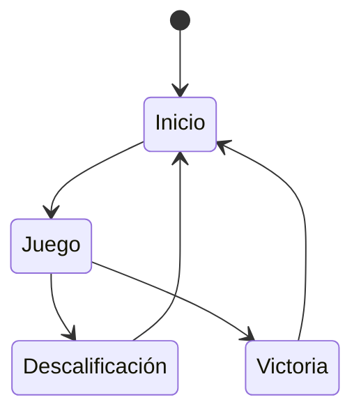
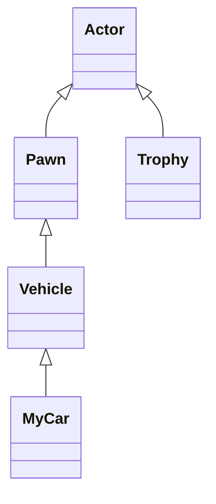

# Desarrollo de Videojuegos - Profesor - Práctica 0: Contrarreloj

Se trata de un prototipo básico de videojuego de carreras en el que controlamos a un coche que debe completar un circuito antes de que el cronómetro llegue a cero.

La versión original del juego fue creada por Federico Peinado. El código se distribuye bajo la licencia LGPL.

El propósito es servir como ejemplo a los alumnos para las demás prácticas de la asignatura.

## Instalación y uso
Los ficheros más importantes del proyecto están disponible en este repositorio, aunque puede que algunos binarios potencialmente grandes estén en el almacén GitHub LFS y se requiera tener activa la extensión Git LFS. 
El resto de los ficheros, generalmente de contenido más pesado o creado por terceros y sin intención de ser modificado en este proyecto, tendrá que descargarse de carpetas compartidas en Google Drive con ficheros ZIP, para después descomprirlos directamente en la carpeta Content. 
Bastante contenido común a todos los proyectos, como StarterContent, LevelPrototyping o ThirdPerson, está [disponible con acceso general aquí](https://drive.google.com/drive/u/0/folders/1TfoB5S3yQw49-onoFfn0q79PTfk2RoSE).

Para hacer esa descarga adicional más cómoda se podría usar GitHub Actions, la herramienta de automatización de GitHub, creando un workflow YAML (en .github/workflows/) que verifica si las carpetas necesarias para este proyecto están ya presentes en el disco duro, descargar los ficheros ZIP (a través del ID público de las carpetas compartidas en Google Drive) y descomprimirlos dentro de la carpeta Content.

## Preproducción
Aunque no hay un enunciado como tal que sirva de punto de partida, la preproducción consistió en el diseño de un juego muy básico de carreras contrarreloj.

El diseño tiene estas secciones:
- [Estética](#Estética)
  * [Gráficos](#Gráficos)
  * [Sonidos](#Sonidos)
- [Dinámica](#Dinámica)
  * [Objetivo](#Objetivo)
  * [Castigo](#Castigo)
- [Mecánica](#Mecánica)
  * [Avatar](#Avatar)
  * [Trofeo](#Trofeo)
- [Contenido](#Contenido)
  * [Cirtuito 1](#Circuito-1)

### Estética
El juego usa solamente el contenido de la plantilla Third Person y el de principiantes (StarterContent). Trata de ser minimalista, simplificando al máximo el diseño del nivel, sin tener un aspecto de producto acabado.

#### Gráficos
El juego usa solamente el contenido de la plantilla Third Person y el de principiantes (StarterContent).

#### Sonidos
Hay una música que suena de fondo y los sonidos son los de la plantilla, salvo el que suena al coger el trofeo al final del circuito:
- **Victoria**. Fanfarria de victoria para cuando el coche alcanza el trofeo.

### Dinámica
La dinámica del juego consiste en llegar hasta el final del circuito antes de que se acaba el tiempo. No es posible morir ni hay otros coches con los que competir, es únicamente una contrarreloj. 

#### Objetivo
El objetivo del juego es recorrer el circuito como se desee hasta conseguir el trofeo que se encuentra justo al final.

#### Castigo
El jugador es desacalificado únicamente si se le acaba el tiempo y no ha conseguido el trofeo. 

### Contenido
A continuación detallamos el contenido más importante del juego.

#### Avatar
El vehículo que viene por defecto en la plantilla correspondiente de Unreal Engine, que se puede conducir con los controles básicos.

#### Trofeo
Se trata de una estatuilla de cristal que representa la recompensa por llegar hasta el final del circuito. Al cogerla, se nos felicita y se reinicia el juego.

### Contenido
Aquí se muestran diagramas topológicos de los distintos niveles. En este caso sólo hay un circuito y lo interesante sería incrustar aquí un esquema o un borrador del mismo, con todos sus elementos.

#### Circuito-1
El circuito es bastante abierto, aunque hay una rampa y un looping que poder hacer con el coche. El trofeo está ubicado al final.

## Producción
Las tareas se han realizado y el esfuerzo ha sido repartido entre los autores (en este caso concentrado en el único autor).

| Estado  |  Tarea  |  Fecha  |  
|:-:|:--|:-:|
| ✔ | Diseño: La idea | 18-09-2024 |
| ✔ | Diseño: Documento inicial | 19-09-2024 |
| ✔ | Mecánica: Cronómetro | 19-09-2024 |
| ✔ | Mecánica: Trofeo | 19-09-2024 |
|  | OPCIONAL |  |
| :x: | Menú |  |
| :x: | ... |  |

Las clases principales que se han desarrollados son las siguientes.

## Posproducción

La única posproducción realizada ha sido generar el ejecutable, hacer las pruebas, editar el video documental con dichas pruebas y publicarlo todo aquí.

## Licencia

A, B y C, autores de la documentación, código y recursos de este trabajo, concedemos permiso permanente a los profesores de la Facultad de Informática de la Universidad Complutense de Madrid para utilizar nuestro material, con sus comentarios y evaluaciones, con fines educativos o de investigación; ya sea para obtener datos agregados de forma anónima como para utilizarlo total o parcialmente reconociendo expresamente nuestra autoría.

Una vez superada con éxito la asignatura se prevee publicar todo en abierto (la documentación con licencia Creative Commons Attribution 4.0 International (CC BY 4.0) y el código con licencia GNU Lesser General Public License 3.0).

## Referencias
- Nitro (Psygnosis, 1990)

